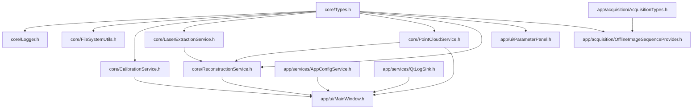
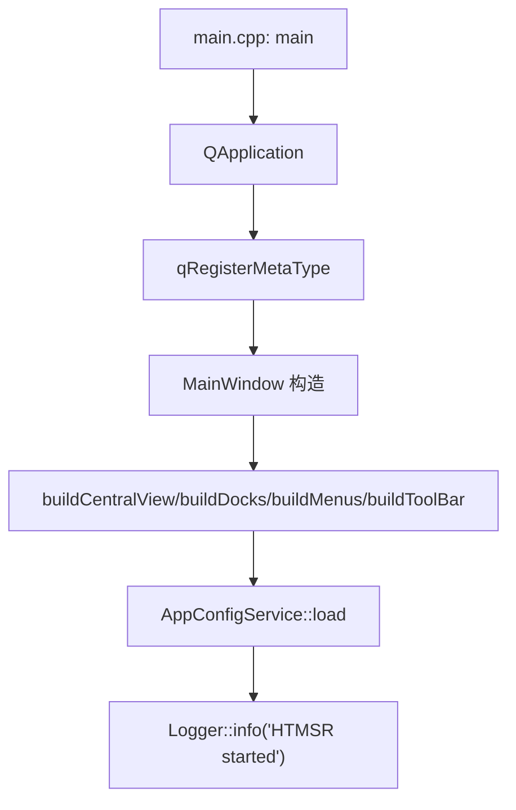
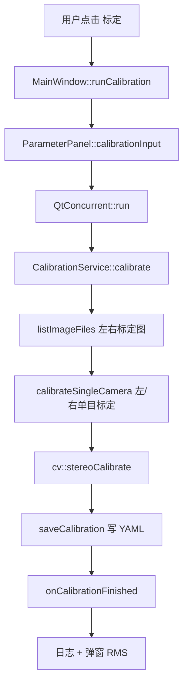
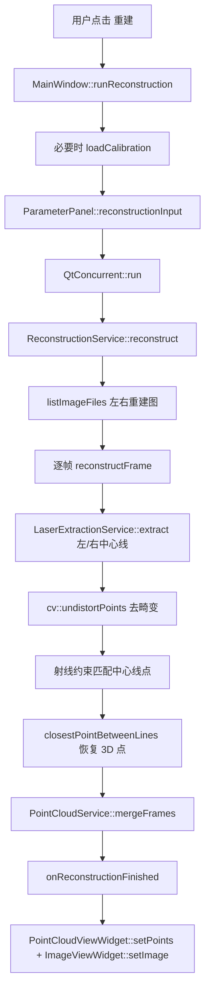

# HTMSR 项目函数调用、包含关系与离线重建流程

## 1. 工程分层

HTMSR 当前工程采用 Qt 桌面层和纯 C++ 核心层分离的结构。

- `htmsr_core`：核心业务库，包含数据模型、标定、激光中心线提取、离线重建、点云合并和导出。
- `htmsr_app`：Qt Widgets 桌面程序，包含主窗口、参数面板、日志面板、图像显示、点云显示占位/VTK 适配。
- `app/services`：Qt 应用服务层，负责 QSettings 配置持久化和 Logger 到 UI 的转发。
- `app/acquisition`：采集预留层，定义相机设备和采集 Provider 接口，首版只有离线图像序列 Provider。

## 2. 核心数据对象

- `Types.h` 是核心数据契约中心，被多数模块包含。
- `CalibrationInput` 描述左右标定目录、棋盘格规格、图像范围和输出 YAML。
- `CalibrationResult` 保存 `K1/D1/K2/D2/P1/P2/R/t/E/F`、RMS 和成功失败统计。
- `LaserExtractionConfig` 描述灰度重心法/Steger、ROI、阈值、颜色、线宽和端点剔除。
- `ReconstructionInput` 描述左右重建目录、图像范围、标定结果、线提取参数和匹配阈值。
- `ReconstructionResult` 保存逐帧结果、合并点云和导出路径。
- `AppProjectConfig` 保存 UI 项目路径、输出目录和默认算法参数。

## 3. 主要包含关系

## 4. UI 到核心业务的调用链

### 4.1 启动链路

### 4.2 标定链路

### 4.3 离线重建链路

## 5. 离线重建算法大致逻辑

1. UI 从参数面板读取左/右重建目录、图像范围、标定文件、ROI、阈值、激光颜色和匹配阈值。
2. 如果内存中没有有效标定结果，则尝试从 `stereo_calibration.yml` 加载 `K1/D1/K2/D2/R/t/E/F/P1/P2`。
3. `ReconstructionService::reconstruct` 扫描左右重建目录中的图片，排序后按最小数量配对。
4. 每一对图像进入 `reconstructFrame`。
5. 左图和右图分别调用 `LaserExtractionService::extract`。
6. 线提取按配置选择灰度重心法或 Steger 法，并生成中心线调试预览图。
7. 提取到的 2D 中心线点通过 `cv::undistortPoints` 去畸变。
8. 将像素点根据内参转为相机射线。
9. 用 `R/t` 将左相机射线转换到右相机坐标关系下。
10. 对左右中心线点做最近射线/极线近似匹配，误差低于 `matchDistanceThreshold` 的点保留。
11. 对每个匹配点对，计算两条空间射线最近点的中点，作为三维点。
12. 所有帧的点云由 `PointCloudService::mergeFrames` 合并。
13. UI 显示点云数量、第一帧中心线预览图，并允许导出 `txt` 和 `pcd`。

## 6. 当前功能边界

- 已有：离线标定、离线重建、灰度重心法、Steger 法、YAML 标定读写、TXT/PCD 点云导出、日志面板、参数持久化。
- 已预留：`ICameraDevice`、`IAcquisitionProvider`、`FramePair`、`OfflineImageSequenceProvider`，后续可接工业相机 SDK。
- 当前限制：点云内嵌三维视图依赖 VTK Qt 组件；未找到该组件时使用占位视图。
- 当前限制：离线重建直接按目录图片配对，还没有接入 `IAcquisitionProvider` 到重建服务。
- 当前限制：暂未实现已有 `pcd/ply/txt/asc` 点云导入查看。

## 7. 后续扩展建议

- 增加 `IReconstructionFrameSource` 或直接让 `ReconstructionService` 接收 `IAcquisitionProvider`，这样离线图像和在线相机可复用同一重建链路。
- 增加点云导入服务，支持 `txt/pcd/ply/asc`，用于测试现有 Cases 素材。
- 将 `Logger` 从单例进一步抽象为可注入接口，方便单元测试和多任务隔离。
- 增加任务进度回调，将逐帧进度、失败帧、有效点数实时反馈到 UI。
- 修复 UI 源码中文字符串编码，避免菜单和弹窗显示乱码。
